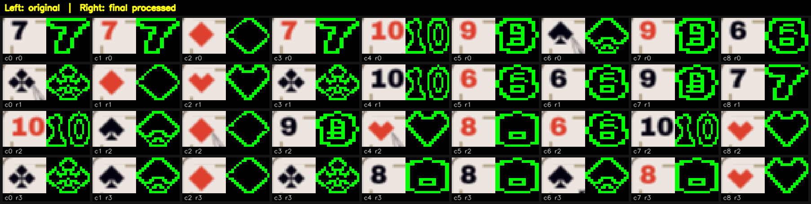
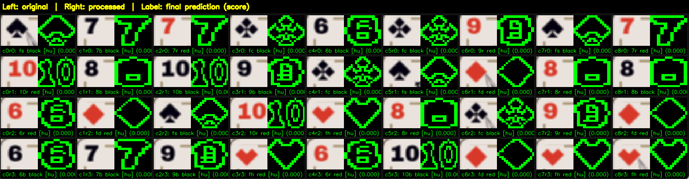
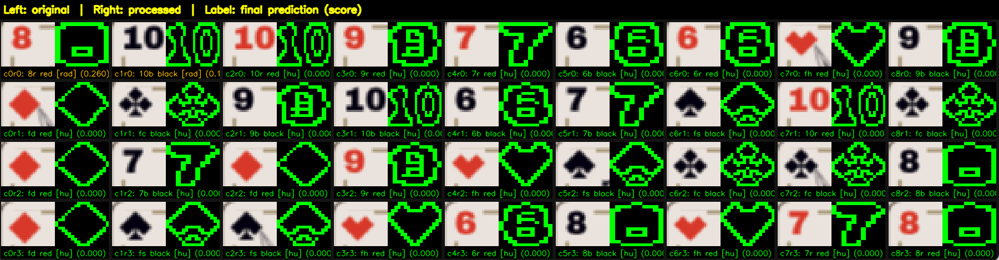

# EXAPUNKS Solitaire Auto-Player

This project detects the EXAPUNKS solitaire board from screen capture, solves it, and executes the moves with mouse automation. The automation is Mac specific but should work fine with a couple tweaks.


## Preface

I am an adict of Zachtronics games, and recently I got EXAPUNKS on Steam sale. There is a level on this game where ypu can just play a variation of solitarie. After beating the game for a couple times, I could just move forward, but  instead of just continuing to play the game, I took the sane decision of building this program to chase the 1.5% achievement for 100 solitaire wins.

This project is inspired by:
- https://yanto.fi/2023/12/creating-a-bot-for-exapunkss-solitaire/

After I could not make yanto's code work reliably on my computer (for wathever reason I can never make other people's work on my machine), I tried replicating the same cv workflow in a different repo, debugging every step of the way, but found many problems using template matching, especially for differentiating between the chatacters [6, 8 9] and [clubs, spades]. After a couple days failing in this direction, I decided to pivot the direction of the coimputer vision algorithm, with many doubts in mind but with a clear determination: I would not show weakness and take the easy way out of using CNNs.

After another day of researching and testing a couple things, I built my own computer-vision pipeline and calibration flow. The computer vision sytem in this repo is designed to be easily recalibrated for other setups see [first time setup](#first-time-setup). The solver, is stright up taken by Yanto's work.

I included the settings board_config and the edge_centroid_compare_params with the values that worked for my monitor, which is 1920x1080. I also ran the calibration for the retine display of the MacBook and found solid results.

If you are having problems setting this up in your computer, you can ping me at [in x](https://x.com/Goubiahrt) and I will be happy to help you use make the proper calibrations/setups.


## Signal Processing Used

Before the solver ever runs, this project treats the game screen as a set of signals and applies lightweight signal-processing steps to make matching stable and fast.

Key ideas used:
- Region-of-interest (ROI) isolation (calibrate.py):
  Probably the first design decision for this project was to create a script that helps isolate only the regions of interest of the cards, which happen to be in the top left, where it indicates the number and color for number cards (6-10), or the card type for face cards (k, q, a, j).
  Even when I changed the approach for this program several times, the ROI isolation through this script was a great idea, focusing the full screenshot into precise board/card windows (`slot_boxes`), makes the computational effort for the image pre-processing and mathcing much simpler, it also helps the bot player know exactly where each card is located (or will be located after some moves). If you put attention at runtime, you will realise that the mouse always grabs the cards exactly in this area.
- Edge detection and centroid:
  I tried several things to try creating a robust system that is able to predict the shape of a card, what worked best for me was using edge detection and centroid compare. This helped me get a very nice shape for all the cards. And this actually solved the hardest challenge for this project, which was to be able to differentiate between the cards [6, 8, 9] and also [spades and clubs]. To get meaningful contours, I created helper scripts (edge_detection_slots_tuner.py) to tune the parameters for the edge detection and distance from centroid filtering (to get rid of the noise in the borders of the image). The results were so good, isolating only the numbers/symbols that I could even crop all the rows/colums from an image where there were only zeros, I found later that this is a common practice called zero-border trimming. I think this was the core idea that made this project work and made ir different from other solvers I have seen around, see the Final processed slots. .
- Contour matching (shape_comparer.py):
  Having pretty sharp contours for each sumbol already made my life very easy I could simply use Hu moment matching, and most of the times the Hu moment similarity matching score would be exactly 0, meaning a perfect score. I can not have an exact idea how many times Hu moment matching is enough, because there are many times when all Hu moment scores are perfect for all cards, but in the system's fist test's, I saw some errors that I could solve with an alternate method. .
- Radial signature fallback (shape_comparer.py):
  I found that Hu-moment comparison works pretty well when the When the score of `cv2.matchShapes(contour1, conteour2) == 0`, however, with values as low as 0.015, the shape prediction would fail miserably. For some weird reason, all the 8s were trated as face diamonds. Lucky for me, I remembered a computer vision class in college where we would use radial signatures for detecting shapes, this is why I decided that,when contour matchin is ambiguous(i.e. `cv2.matchShapes(contour1, conteour2) > 0`), a radial projection signature is compared as a second, more robust shape signal. Again, I can not give exact numbers, but it took me about 5 tries to finally find a board that used the radial signature heuristic. I captured this image where the first two elements (c0 r0 & c1 r0) fall back to radial signature matching, as Hu moment mathcin score is over 0.01 .
- Temporal stability check (repeat_player):
  In repeat mode, I wanted to make sure not a single second was wasted, in order to get my 100 games achievement as soon as possible. So I implemented a simple frame-to-frame board differences measurement over time to detect when deal animation has stopped, then I know the screen already contains a stable image that can be used by the shape_comparer.

## Computer Vision Overview

The CV stack is designed to convert screen pixels into a normalized symbolic board, basically an encoding the computer can work with.

Stages:

1. Screen capture and geometric calibration (`calibrate.py` + `board_config.json`)
2. Image processing (`edge_detection_slots_tuner.py` + `edge_detection_slots_view.json` + `edge_detection_centroid_compare.py` + `edge_detection_compare_params.json`)
3. Shape recognition against tagged contours (`tagged_shapes/`)
4. Hybrid matching strategy:
   - primary: contour matching (Hu moments)
   - fallback: radial signature distance
5. Red/black classification from HSV cues for numbered cards (trivial, literally easiest thing I have coded in my life)
6. Sanity checks on predicted card counts
7. Export to machine-readable state (`normalized_board_state.json`)

This gives the solver a clean symbolic input and decouples game logic from raw image processing.

## Solver Overview

I didn't create this, I used the codebase by Yanto to extract the pseudocode of the solver and asked an agent to imlpement such pseudocode over a template I had been working on.

The solver in `solver.py` is a best-first search over a 10-stack model:
- stacks `0..8`: board columns
- stack `9`: spare/holder slot

Input and output:
- Input: `normalized_board_state.json` (refreshed by running `shape_comparer.py` in solver mode)
- Output: `planned_moves.json` with ordered move actions (`source_stack`, `target_stack`, `move_count`)

Card model and rules:
- Number cards use ranks `6..10` with red/black color
- Face cards are treated as rank `12` (king-like class) with suit
- Valid adjacency is:
  - descending by 1 with alternating colors, or
  - king-on-king with same suit (special rule)

Finished stack detection:
- 4 kings of the same suit, or
- a complete `10-9-8-7-6` alternating-color run

Move generation strategy:
1. Top card to spare (if spare is empty)
2. Spare to unfinished board stacks (when legal)
3. Largest legal movable suffix from one board stack to another

Search strategy:
- Priority queue (best-first)
- Priority is `(unfinished_stack_count, move_count)`
- State deduplication prevents revisiting equivalent board states
- Stops when unfinished stacks reach target condition (effectively solved)

Why this works well here:
- CV and logic are decoupled, so recognition can improve without rewriting search
- The solver always re-reads the current board before planning
- Move plans are deterministic and easy for the executor to replay

Main pipeline:
1. `shape_comparer.py` reads the board and writes `normalized_board_state.json`
2. `solver.py` plans moves and writes `planned_moves.json`
3. `executor.py` performs drag-and-drop moves
4. `repeat_player.py` loops New Game -> wait animation -> solve -> execute

## Files You Will Use Most

- `calibrate.py`: board geometry calibration (`board_config.json`)
- `shape_comparer.py`: CV recognition and board-state export
- `solver.py`: logical move planner
- `executor.py`: one-shot automation run
- `repeat_player.py`: repeated game loop with round logging
- `board_config.json`: calibration data (board, holder, New Game button)

## Requirements

Python 3.10+ recommended.

Packages used:
- `opencv-python`
- `numpy`
- `Pillow`
- `pyautogui`
- `pynput`

If needed:

```bash
python3 -m venv venv
source venv/bin/activate
pip install opencv-python numpy pillow pyautogui pynput
```

On macOS, allow Accessibility permissions for terminal/Python so mouse automation can click and drag.

## First-Time Setup

1. Activate your environment:

```bash
source venv/bin/activate
```

2. Calibrate board geometry:

```bash
./venv/bin/python calibrate.py
```

3. Tag shapes from slots (required):

```bash
./venv/bin/python tag_shapes_from_slots.py
```

4. Build shape signature cache:

```bash
./venv/bin/python shape_comparer.py --precompute-sigs
```

5. First run of `executor.py` or `repeat_player.py` will prompt missing calibrations:
- holder slot (`holder_box`)
- New Game button (`new_game_button`, repeat mode only)

## One-Shot Run

Solve + execute one board:

```bash
./venv/bin/python executor.py
```

Dry run (no mouse actions):

```bash
./venv/bin/python executor.py --dry-run
```

Useful timing controls:

```bash
./venv/bin/python executor.py \
  --delay 0 \
  --drag-duration 0.015 \
  --pre-hold 0.008 \
  --post-hold 0.008 \
  --approach-delay 0.005 \
  --focus-delay 0.05
```

## Repeat Mode (Auto Farm)

Run forever:

```bash
./venv/bin/python repeat_player.py
```

Run N rounds:

```bash
./venv/bin/python repeat_player.py --max-games 20
```

Recalibrate New Game button:

```bash
./venv/bin/python repeat_player.py --recalibrate-new-game
```

Repeat mode controls:
- New Game click robustness:
  - `--new-game-clicks`
  - `--new-game-hold`
  - `--new-game-between`
- Deal animation wait:
  - `--animation-start-delay`
  - `--animation-max-wait`
  - `--sample-interval`
  - `--stable-frames`
  - `--diff-threshold`

## Logs

Round logs are written as JSONL (one JSON object per line):
- default file: `repeat_player_log.jsonl`
- change path with `--log-file`

Example:

```bash
./venv/bin/python repeat_player.py --log-file runs/session_01.jsonl
```

## Data Artifacts

- `board_config.json`: calibration and coordinate anchors
- `normalized_board_state.json`: CV output board state
- `planned_moves.json`: solver output move plan
- `repeat_player_log.jsonl`: per-round stats in repeat mode

## Troubleshooting

If New Game moves mouse but does not click:
- increase `--new-game-hold` (example `0.06`)
- increase `--new-game-between` if using multiple clicks
- increase `--focus-delay` slightly (example `0.05` to `0.15`)
- rerun `--recalibrate-new-game`

If drag/drop misses target row:
- keep `--drag-duration` above zero (for example `0.01` to `0.03`)
- keep tiny non-zero `--pre-hold` and `--post-hold`
- verify `board_config.json` calibration is still valid at your current resolution

If solver often reports no path:
- run `shape_comparer.py` manually and inspect recognition quality
- verify label quality in `tagged_shapes/`
- recalibrate board geometry

## Script Help

For full option lists:

```bash
./venv/bin/python calibrate.py --help
./venv/bin/python shape_comparer.py --help
./venv/bin/python solver.py --help
./venv/bin/python executor.py --help
./venv/bin/python repeat_player.py --help
```

## Future work

I still have some optimization ideas in mind:

1. Multi threading:
  Perhaps the most obvious one, we could be processing multiple images at once in the image processing / pattern recognition step to see how much time can is saved.
2. Alternate contour generation algorithms:
  I really liked the results of the image processing after the edge detection and the distance from centroid filtering, but it feels like I simply got lucky. I would like to explore more algorithms and techniques to achieve nice edges.
3. Character matching algorithms:
  I don't really have an idea how much slower radial signature is than Hu moments. I would like to run a benchmark test.
4. Solver optimization:
  According to my log at `repeat_player_log.jsonl`, most of thje solutions I found were over 30 movements long. I would like to explore better solver alternatives that find more optimal moves.
5. Bot playing efficiency:
  Out of every 100 plays, about 80% will fail because the bot is too fast. I can tune the wait parameters so to get the Goldilocks tune that is fast for moving the cards, but not so fast that the game does not register a movement.
6. CNN's for pattern recognition
  I hate using deep learning as a silver bullet just as much as the next nerd guy, but I would like to do so just to see how much the performance drops.
7. Solve the solitaire for Shenzen IO lol.
